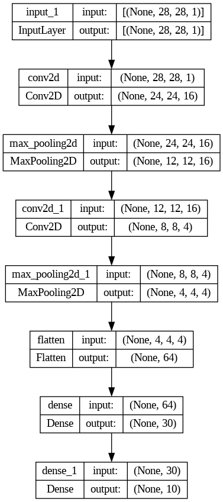
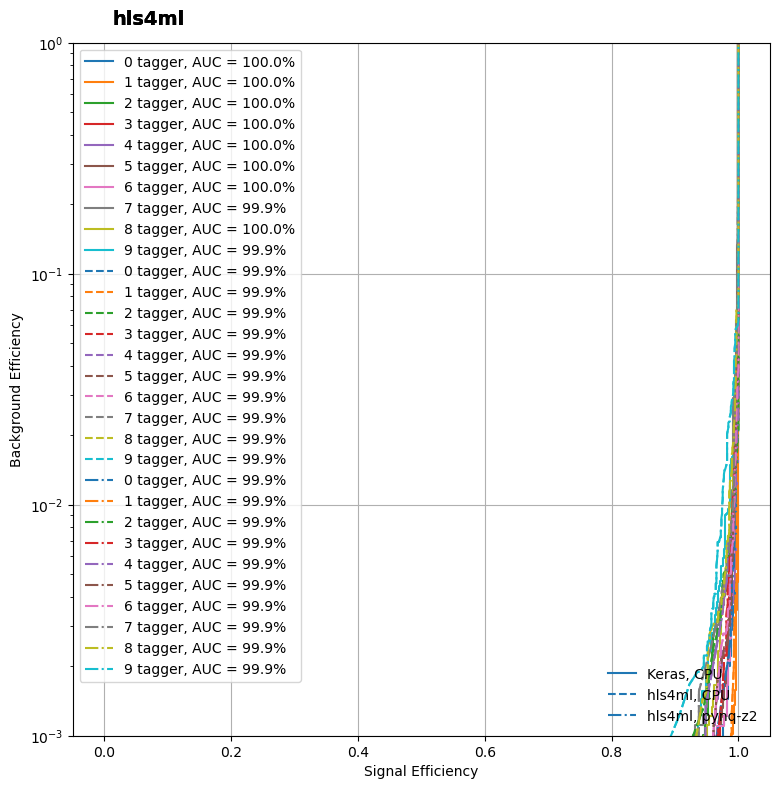

# LeNet

# Impact of reduced layer size on the network

## Test Bench
- Test devise: Apple M2 Pro
- System Memory: 16.00 GB
- Max Cache Size: 5.33 GB
- Python Version: 3.10.11
- TensorFlow Version: 2.12.0
- Epochs: 30

| Bench| conv2d | conv2d_1 | dense | dense_1 | Acc | Total Params |
|---------|---------|---------|---------|---------|---------|---------|
|1|520|25050|400500|5010|0.9651|431080|
|2|520|15030|240500|5010|0.9630|261060|
|3|520|4008|64500|5010|0.9597|74038|
|4|520|4008|12900|1010|0.9460|18430|
|5|520|4008|8256|650|0.9469|13434|
|6|520|4008|4128|330|0.9412|8986|
|7|520|4008|3870|310|0.9392|8708|
|8|520|3006|2910|310|0.9414|6746|
|9|520|2004|1950|310|0.9228|4784|
|10|416|1604|1950|310|0.9393|4280|

## Final Network

## Final Implementation

### Utilization of PYNQ-Z2

| Resource| Utilization | Available | Utilization% | 
|---------|---------|---------|---------|
|LUT|39107|53200|73.51|
|LUTRAM|1099|17400|6.32|
|FF|51367|106400|48.28|
|BRAM|30.50|140|21.79|
|DSP|10|220|4.55|
|BUFG|1|32|3.13|

### Power of PYNQ-Z2
| Clocks| Signals | Logic | BRAM | DSP | PS7 | PL Static | Total Power 
|---------|---------|---------|---------|---------|---------|---------|---------|
|0.135|0.079|0.058|0.051|0.010|1.256|0.146|1.737|

### Speed 

| Device | Total Time | Inferences / Sec |  
|---------|---------|---------|
|Xilinx XUP PYNQ-Z2 | 0.730162 | 13695.5908|
|Intel Core i9-9900K| 4.662593 | 2144.7292|
|Apple M2 Pro|3.450132|2898.4399|
|NVIDIA Tesla T4|1.350541|7404.4395|
|NVIDIA Tesla P100|1.090698|9168.4447|
|NVIDIA Quadro P6000|1.793645|5575.2381|
|NVIDIA GeForce RTX 2080 Ti|N/A|N/A|
|NVIDIA GeForce RTX 3090|1.860448|5374.9409|

### Accurary

|| Device | Accuracy |
|---------|---------|---------|
|Keras|CPU|0.9777|
|hls4ml|CPU|0.9739|
|hls4ml|PYNQ-Z2|0.9739|

