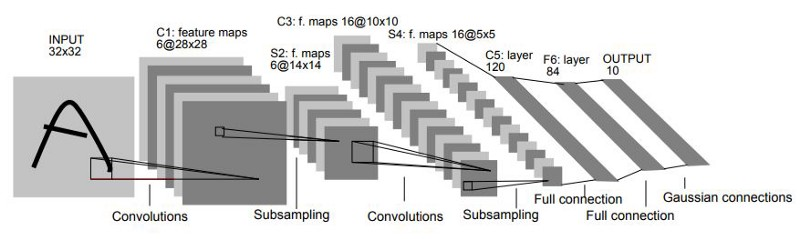

# LeNet Arch



# Impact of reduced layer size on the network

## Test Bench
- Test devise: Apple M2 Pro
- System Memory: 16.00 GB
- Max Cache Size: 5.33 GB
- Python Version: 3.10.11
- TensorFlow Version: 2.12.0
- Epochs: 30

| Bench| conv2d | conv2d_1 | dense | dense_1 | Acc | Total Params |
|---------|---------|---------|---------|---------|---------|---------|
|1|520|25050|400500|5010|0.9651|431080|
|2|520|15030|240500|5010|0.9630|261060|
|3|520|4008|64500|5010|0.9597|74038|
|4|520|4008|12900|1010|0.9460|18430|
|5|520|4008|8256|650|0.9469|13434|
|6|520|4008|4128|330|0.9412|8986|
|7|520|4008|3870|310|0.9392|8708|
|8|520|3006|2910|310|0.9414|6746|
|9|520|2004|1950|310|0.9228|4784|
|10|416|1604|1950|310|0.9393|4280|

## Final Network

```python
def LeNet(input_tensor):
    # Convolutional Layer 1
    conv1 = tf.keras.layers.Conv2D(filters=16, kernel_size=5, activation='relu', padding='valid')(input_tensor)
    pool1 = tf.keras.layers.MaxPooling2D(pool_size=2, strides=2)(conv1)

    # Convolutional Layer 2
    conv2 = tf.keras.layers.Conv2D(filters=4, kernel_size=5, activation='relu', padding='valid')(pool1)
    pool2 = tf.keras.layers.MaxPooling2D(pool_size=2, strides=2)(conv2)

    # Flatten the previous layer
    flatten = tf.keras.layers.Flatten()(pool2)

    # Fully Connected Layer 1
    fc1 = tf.keras.layers.Dense(units=30, activation='relu')(flatten)

    # Fully Connected Layer 2 (Output layer)
    fc2 = tf.keras.layers.Dense(units=10, activation=None)(fc1)

    return fc2

input_tensor = tf.keras.Input(shape=(28, 28, 1))
output_tensor = LeNet(input_tensor)

model = tf.keras.Model(
    inputs=input_tensor, 
    outputs=output_tensor
)

model.compile(optimizer=tf.keras.optimizers.legacy.SGD(learning_rate=0.01),
              loss=tf.keras.losses.SparseCategoricalCrossentro(from_logits=True),
              metrics=['accuracy']
)
```